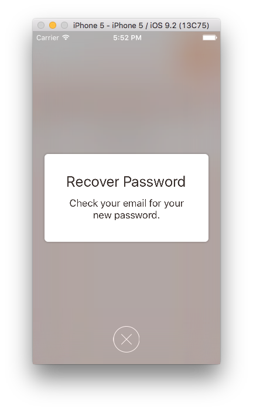

## CDVFormSheetController
Super lightweight MZFormSheetController subclass to use with: https://github.com/m1entus/MZFormSheetController with some extra features listed below

## Requirements

- iOS 7 or higher
- ARC

## When to use
- you want to have MZFormSheetController without dismissing by tapping background
- you want to add more than one effect to background at a time
- you want to add custom controls to background

## Installation
Drag CDVImagePickerViewController folder to your project 

## Contact
[Alex](https://github.com/alexth)

##License
GNU GENERAL PUBLIC LICENSE. See `LICENSE` file for more details

